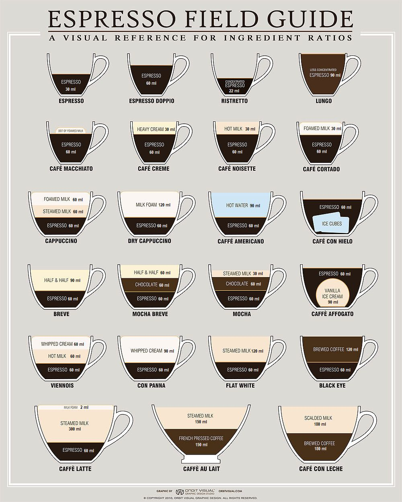

# Coffee

Coffee and coffee related topics materials

## Kinds of coffee
1. Espresso: This is a finely ground very dark roast coffee, packed somewhat tightly in a special metal filter, with water "expressed" through it under pressure. A very strong dark coffee, typically served in 1-2 ounce portions. Very commonly incorrectly called "Expresso."
2. Americano: Italians typically don't drink American Strength coffee. They drink espresso in tiny cups. Then the tourists came and wanted a mug of coffee like they get at home. The Italian solution was to make an espresso and keep the water running through the grounds to weaken the coffee, and make the desired quantity. (edit: Some locations may simply add hot water to the espresso in the cup. This doesn't change the basic concept.) An Americano is simply an espresso that has been drawn out with extra water to an American strength beverage -- Not to be confused with the typical brewed coffee, which is usually filtered.
3. Caffe au Lait: This is strong filtered or brewed coffee (not espresso), with warmed milk. This is probably the easiest specialty coffee to make at home. Just scald some milk in a pot and pour it over strongly brewed coffee.
4. Cappuccino: A 1:1:1 ratio of espresso, steamed milk, and milk foam. Typically the milk is steamed through a special high pressure steam pipe on the espresso machine. This serves two functions. To warm up the milk and to create a stiff foam on the top. When pouring, the foam is held back with a spoon, and then scooped out on top. I'll arbitrarily define the cappuccino as the base beverage for all that follow.
5. Macchiato: Typically in North America, this is a cappuccino, but with the steamed milk component missing. That is, it is espresso and frothed milk foam only. Also called a "Dry" Cappuccino. Macchiato has different meanings elsewhere.
6. Latte: A "wet" cappuccino. Hold back the foam with a spoon, and pour the warm milk over the espresso. Put a little bit of foam on top for decoration only.
7. Mocha: Any one of the above espresso + milk drinks with chocolate added. Some places will add hot chocolate to the drink, others will add a chocolate syrup. A mocha latte is the common preparation. Not to be confused with Mocha beans, which are an Ethiopian coffee bean which has a little bit of a naturally occurring chocolate flavour.
8. Misto: A Starbucks synonym for a Cafe au Lait.

